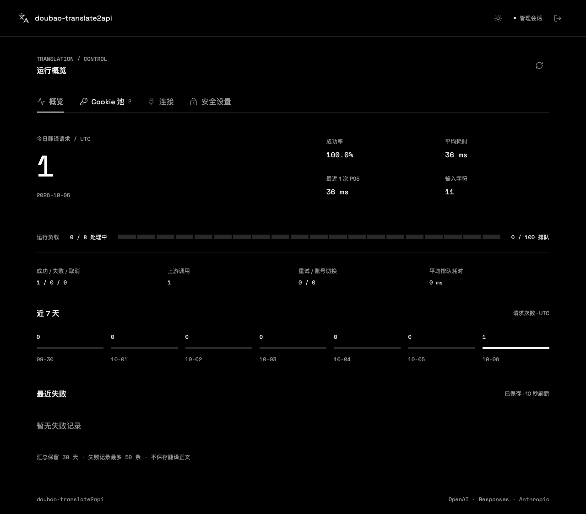

# doubao-translate2api

想法来自 [linux.do](https://linux.do/) 中帖子 https://linux.do/t/topic/2988583 

> **免责声明**
>
> 本项目是独立的非官方实现，与豆包及其他相关平台不存在隶属或合作关系，也不代表获得其授权、认可或背书。相关名称与商标属于各自权利人。
>
> 本项目旨在供学习、研究和开发交流。使用者应自行确认并遵守适用法律法规、相关平台的服务条款及账号使用规则，仅使用本人拥有或已获合法授权的账号与 Cookie，不得用于违法活动或侵害他人权益。
>
> 软件按 MIT 许可证以“现状”提供，不保证接口持续可用、翻译准确、账号安全或适用于特定用途。网页接口变更、账号风控或封禁、Cookie 与密钥泄露、服务中断、翻译错误及其他使用风险，均由使用者自行评估并承担。
>
> 在适用法律允许的范围内，作者和贡献者不对使用或无法使用本项目产生的损失、索赔或其他责任负责。下载、部署或使用前，请阅读本声明及 [MIT 许可证](LICENSE)；如无法接受相关风险，请勿使用。

将豆包网页翻译转换为 OpenAI Chat、OpenAI Responses 和 Anthropic Messages API，供翻译客户端调用。支持多 Cookie 管理、故障切换和按请求轮询。

仅提供文本翻译，不是通用聊天模型。

## 项目入口

| 入口 | 用途 |
| --- | --- |
| [API 服务源码与部署文档](https://github.com/mu-zi-lee/doubao-translate2api) | 在 NAS 或服务器部署，向多个翻译客户端提供兼容 API |
| [Docker Hub 镜像](https://hub.docker.com/r/muzileee/doubao-translate2api) | 拉取 `muzileee/doubao-translate2api` 部署 API 服务 |
| [Magpie 直连插件](https://github.com/mu-zi-lee/opencode-doubao-translate) | 在 Magpie 中导入豆包 Cookie，直接翻译，无须部署 API 服务或 Docker |
| [Cloudflare Workers 实验版](docs/cloudflare-workers.md) | 在自己的 Cloudflare 账号部署单 Cookie 翻译接口，无需服务器 |

服务版和插件版共用翻译核心，可按使用场景选择。服务版提供管理页、Cookie 池和 API Key；插件版由 Magpie 管理账号与故障切换。

只在 Magpie 中使用时，在「插件 → 发现」底部安装框填写以下内容，安装后选择 **Import Doubao Cookie**：

```text
github:mu-zi-lee/opencode-doubao-translate
```



<details>
<summary>查看手机界面</summary>


</details>

截图使用模拟账号，API Key 保持隐藏。

## Cloudflare Workers 部署

Workers 版本共用翻译核心，提供三种协议和翻译引擎。通过 Cloudflare Secrets 配置 `DOUBAO_COOKIE` 与 `API_KEY`，适合个人接入沉浸式翻译；没有管理后台和多账号池。

[](https://deploy.workers.cloudflare.com/?url=https://github.com/mu-zi-lee/doubao-translate2api)

实验版已包含本地 Workers 运行时测试，真实 Cloudflare 到豆包请求和扩展联调仍需验收。按钮需要默认分支包含 Workers 实现；尚未同步源码时，可按[新手部署指南](docs/cloudflare-workers.md)使用本地命令部署。

部署页面的构建命令使用 `npm run build:workers`，部署命令使用 `npm run deploy:workers`，项目根目录保持仓库根目录。默认支持沉浸式纯文本 `%%` 分隔格式，暂不支持 YAML 和富文本模板。完整配置、Cookie 获取、接口检查和排错步骤见指南。

另提供 [Lite 单文件版](docs/cloudflare-workers.md#lite-单文件版)：构建出的独立 ESM JavaScript 必须小于等于 32,000 字节，超限会让构建失败。运行 `npm run build:workers:lite` 生成 `.artifacts/workers-lite/worker.js`。只保留 `doubao-ai` 的非流式 Chat Completions、健康检查、纯文本分批翻译和 API Key 鉴权。

## Docker 部署

镜像：[muzileee/doubao-translate2api](https://hub.docker.com/r/muzileee/doubao-translate2api)，标签 `latest`，当前版本 `0.1.3`，支持 AMD64 / ARM64。

1. 将 [docker-compose.nas.yml](docker-compose.nas.yml) 保存为项目目录中的 `docker-compose.yml`，或粘贴到 NAS 的 Compose 创建窗口。
2. 在项目目录创建 `data/admin`，确保容器用户有写入权限。
3. 启动项目，打开 `http://服务器IP:8390/admin`。

默认运行用户为 `1000:1000`。需要准备目录权限时，在项目目录执行：

```sh
mkdir -p data/admin
sudo chown 1000:1000 data/admin
sudo chmod 700 data/admin
docker compose up -d
```

NAS 配置默认允许局域网访问。公网部署请使用 HTTPS 反向代理；仅本机访问可改用 [docker-compose.hub.yml](docker-compose.hub.yml)，配合 [.env.example](.env.example)，默认绑定 `127.0.0.1`。

## 首次使用

查看自动生成的管理密码：

```sh
docker compose exec doubao-translate2api cat /admin-data/initial-password.txt
```

也可以在 NAS 文件管理器中查看 `data/admin/initial-password.txt`。登录后：

1. 在「Cookie 池」导入豆包 Cookie，支持 Cookie Header、JSON 导出，以及 `.txt` / `.json` 文件。
2. 点击检测，确认账号登录有效。
3. 在「连接」复制 API Key，填入翻译客户端；也可直接进行翻译测试。

管理页默认使用 Nothing 风格深色主题，可切换浅色并记住选择。概览显示今日翻译请求、成功率、输入字符、平均耗时、P95、并发与排队、上游调用、重试、账号切换、近 7 天趋势和最近失败。

统计按 UTC 日期归档，仅统计通过参数校验并进入翻译流程的请求，包含管理页翻译测试；登录检测、鉴权失败与参数错误不计入。每个客户端请求计一次，分批和重试计入上游调用；成功率排除客户端取消。耗时包含排队、上游及重试，P95 使用当天最近最多 256 个完成请求（包含失败与取消）的样本。字符数按 Unicode 码点计数。

`usage.json` 保留 30 天汇总和最多 50 条失败记录，页面展示最近 10 条；不保存原文、译文、Cookie 或 API Key。统计与自动账号运行状态每 10 秒保存，并在正常停机时保存；异常断电可能丢失最近约 10 秒的数据。保存错误在概览显示并记录日志，不影响已成功的翻译；损坏的统计文件会保留供检查，不会自动覆盖。账号编辑和管理配置仍立即保存。数据目录适用于单进程服务，多个实例需各自独立目录。

字体通过 Google Fonts 加载 Space Grotesk 与 Space Mono，中文使用系统字体；无法访问 Google Fonts 时回退到系统字体，不影响管理功能。

管理密码与 API Key 独立。API Key 首次启动生成，重启和升级继续使用；重新生成会立即使旧 Key 失效，需要同步更新客户端。

| Cookie 调度 | 行为 |
| --- | --- |
| 故障切换（默认） | 优先使用当前账号，失效、限流或临时故障时切换 |
| 轮询 | 每个请求分配下一份可用 Cookie，故障时仍可切换 |
| 固定账号 | 只使用指定账号 |

Cookie 过期后更新即可，不提供自动登录。保存的数据在 `data/admin`，包括 Cookie、管理凭据和 API Key；升级时保留并备份此目录，不要公开或上传这些文件。

## 连接客户端

API Key 使用管理页复制的值。

| 客户端 / 协议 | Base URL |
| --- | --- |
| OpenAI Chat / Responses | `http://服务器IP:8390/v1` |
| Anthropic 官方 SDK | `http://服务器IP:8390` |

模型可选 `doubao-ai`、`volcengine-translate`、`microsoft-translator`，分别对应豆包 AI、火山翻译和微软翻译。三者均通过豆包网页接口调用。

Magpie 选择相应兼容 Provider，并填写 Base URL、API Key 和模型。若客户端自行追加 `/v1`，填写根地址，避免重复路径。

未指定目标语言时默认翻译为简体中文，可在管理页的“默认目标语言”中修改，立即生效并在重启后保留。请求中的 `target_lang`、`X-Doubao-Target-Lang` 或明确的翻译指令按此顺序优先于默认设置；明确指定不支持的语言或同级语言冲突仍返回错误。

客户端可通过 `GET /v1/models` 获取模型列表，或通过 `GET /v1/models/模型ID` 获取单个模型信息；均需要 API Key，兼容 OpenAI 与 Anthropic SDK。

```sh
curl http://服务器IP:8390/v1/chat/completions \
  -H "Authorization: Bearer 你的APIKey" \
  -H "Content-Type: application/json" \
  -d '{"model":"doubao-ai","target_lang":"zh","messages":[{"role":"user","content":"Hello world"}]}'
```

仅翻译最后一条 user 文本，不支持图片、工具调用或对话记忆。支持流式格式，但会在上游翻译完整成功后发送结果；usage 固定为 0。

## 配置与升级

全部参数见 [.env.example](.env.example)。NAS 模板无须 `.env`；服务参数可在 Compose 的 `environment` 中添加，运行用户则修改 `user` 或在项目 `.env` 设置 `APP_UID` / `APP_GID`。

| 参数 | 默认 / 用途 |
| --- | --- |
| `API_KEY` / `API_KEYS` | 可不填；手动配置优先，管理页不能修改环境变量中的 Key |
| `APP_UID` / `APP_GID` | Compose 运行用户，默认 `1000:1000`，与数据目录所有者匹配 |
| `DOUBAO_MAX_CONCURRENCY` | 上游并发，默认 `8` |
| `DOUBAO_DEFAULT_TARGET_LANG` | 首次初始化的默认目标语言，默认 `zh`；已有管理页设置优先 |
| `DOUBAO_TOTAL_TIMEOUT_MS` | 整个翻译请求的时间预算，默认 `180000` 毫秒，包含分批、排队和重试 |
| `ADMIN_COOKIE_SECURE` / `ADMIN_ORIGIN` | HTTPS 反代时设置为 `true` / 实际域名 |
| `TRUST_PROXY` | 仅填写实际可信反代的 IP 或网段 |

Compose 模板使用 `latest` 和 `pull_policy: always`，启动或重新部署时会检查最新版，无须修改版本号。更新正在运行的容器时执行：

```sh
docker compose pull
docker compose up -d
```

运行中的容器不会自行升级。需要定时更新时，可在 NAS 任务计划中定期运行上述命令；保留 `data/admin` 目录即可保留账号、密码、API Key 和默认语言。需要固定版本时，将镜像标签改为 `0.1.3`。

自动生成的 Key 在 `data/admin/api-key.txt`，权限为 `600`。文件损坏或不可读会拒绝启动；不会自动替换。修改管理密码会退出所有管理会话，但不会改变 API Key。

## 本地开发

需要 Node.js 24。

```sh
npm ci
npm run typecheck
npm test
npm run build
DOUBAO_COOKIE_FILE=./data/cookie.txt npm run dev
```

本地管理页：`http://127.0.0.1:8000/admin`。浏览器测试运行 `npm run test:ui`，首次需 `npx playwright install chromium`。CI 包含协议 SDK、浏览器和 Docker 检查；模拟测试通过不代表真实豆包或 Magpie 验收完成。

发布时推送与 `package.json` 版本一致的标签，例如 `v0.1.3`。GitHub Actions 检查通过后自动上传双架构镜像；需要配置 `DOCKERHUB_USERNAME` 和 `DOCKERHUB_TOKEN` Secrets。
